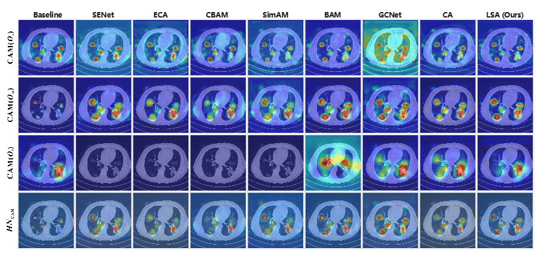

# PLDet: Intra-layer Multi-scale Perception and Local Space Attention for Pulmonary Lesion Detection in CT Images

This paper has been accepted at Biomedical Signal Processing and Control (BSPC).  

🔥 Our [TinyU-Net: Lighter Yet Better U-Net with Cascaded Multi-receptive Fields](https://doi.org/10.1007/978-3-031-72114-4_60) [[Official Implementation](https://doi.org/10.1007/978-3-031-72114-4_60)]  has been published at `MICCAI 2024` as an `Oral` (2.7% of submissions).


## BibTex
```bibtex
@InProceedings{Chen_PLDet,
        author    = {Chen, Junren and Wang, Wei and Cheng, Junlong and Liang, Gang and Zhang, Lei and Chen, Liangyin},
        title     = {PLDet: Intra-layer Multi-scale Perception and Local Space Attention for Pulmonary Lesion Detection in CT Images},
        year      = {2026},
        # todo: add booktitle, publisher, volume, month, pages
}

@InProceedings{Chen_TinyUNet_MICCAI2024Oral,
        author    = {Chen, Junren and Chen, Rui and Wang, Wei and Cheng, Junlong and Zhang, Lei and Chen, Liangyin},
        title     = {TinyU-Net: Lighter Yet Better U-Net with Cascaded Multi-receptive Fields},
        booktitle = {Medical Image Computing and Computer Assisted Intervention -- MICCAI 2024},
        year      = {2024},
        publisher = {Springer Nature Switzerland},
        volume    = {LNCS 15009},
        month     = {October},
        pages     = {626--635}
}
```

## 📌 Abstract
Automated and precise detection of lesions in chest computed tomography (CT) images is essential for diagnosing pulmonary diseases.  However, existing multi-scale feature-based and visual attention-based methods struggle to achieve adequate multi-scale perception and local context focus in features, which hinders their ability to capture fine-grained representations, thereby limiting their effectiveness in addressing lesion scale variability and lesion instance locality, ultimately leading to suboptimal detection performance.  To this end, we propose a novel Pulmonary Lesion Detection (PLDet) approach.  Specifically, we propose an Intra-layer Multi-scale Perception (IMP) module that employs a novel multi-branch feature extraction strategy, which is orthogonal to the methods that utilize layer-wise operations to capture multi-scale information, enabling the extraction of more fine-grained information from different receptive fields within a single network layer.  Additionally, we propose a Local Spatial Attention (LSA) network that captures local context information from both row and column spaces of the feature maps using a few parameters, while circumventing the traditional attention mechanism's dependence on global computing and channel dimensionality reduction, thereby preserving the integrity of the original context.  PLDet outperforms advanced methods in pulmonary lesion detection tasks on chest CT images. Extensive experimental results suggest that our PLDet approach holds promise as an initial reading and/or screening tool in chest CT images to combat pulmonary diseases.

## 🔍 Methodology
### PLDet Architecture

The overview of our PLDet. The proposed PLDet adopts YOLO architecture, including three functional networks: the backbone, neck, and head networks.  Both the IMP module and LSA network are integrated into the backbone and neck networks.

Our framework is primarily derived from [YOLOX](https://github.com/bubbliiiing/yolox-pytorch), a popular deep learning framework for object detection, thanks to open source. Specifically, the original CSPLayer was replaced by a cascaded configuration of the proposed IMP and LSA modules. We leverage this open-source foundation to ensure the reproducibility and scalability of our PLDet model.

### IMP Architecture

Structures of the IMP (Ours), Inception, and ASPP modules. (a) The proposed IMP module enhances intra-layer multi-scale representation through an inverted bottleneck structure that widens intermediate channels. It employs three parallel branches of $3 \times 3$ depthwise dilated convolutions with distinct rates, interconnected by orthogonal-like residual pathways to bolster feature interaction and representation. (b) The structure of the Inception module. (c) The structure of the ASPP module.

See `IMP_Intra-layerMulti-scalePerception.py` for detailed usage.

### LSA Architecture

The overview of our LSA. TThe LSA network structure involves several steps: first, features are aggregated in both row and column spaces of the feature map using average and max pooling, respectively.  Next, the results from both pooling operations are weighted, summed, and processed with depthwise convolutions to extract local context information.  Attention weight vectors for both row and column spaces are generated using the sigmoid function, expanded to match the input feature map's size, and fused with it using the Hadamard product.  Finally, the attention map is combined with the input feature map via skip connections to produce the final output feature map.

See `LSA_LocalSpatialAttention.py` for detailed usage.

## 🖼 Qualitative Results for LSA

Comparative qualitative results of our  LSA network and different visual attention mechanisms.  The first three rows show outcomes for small, medium, and large objects, respectively, while the last row presents the overall results of the head network.  Redder colors indicate higher attention weights in the feature map.